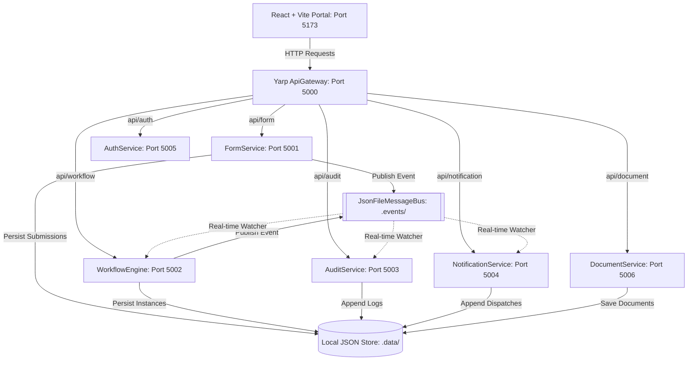

# 🛡️ SecureSchoolForms

An advanced, decentralized, **event-driven administrative portal** designed for school districts to securely submit, route, approve, and audit student forms. 

Built using a **zero-trust design philosophy**, the system decomposes administrative actions into modular, isolated C# .NET 8 microservices, coordinated via an event-driven pub-sub architecture, and driven by a state-of-the-art **glassmorphic React dashboard frontend**.

---

## 🏗️ System Architecture

The solution implements a zero-trust, event-driven pattern with YARP (Yet Another Reverse Proxy) serving as the entry API Gateway. To ensure the environment remains **self-contained and zero-dependency** for local execution, the microservices communicate asynchronously using a custom **JSON File-Based Message Bus** with `FileSystemWatcher` acting as a real-time reactive pub-sub hub.



---

## 🚦 Port Allocation & Microservices

The application is split into 8 logical projects:

| Service Name | Port | Description |
| :--- | :--- | :--- |
| **`SecureSchoolForms.ApiGateway`** | `5000` | YARP-based gateway routing requests to the target microservice, handling global CORS policies. |
| **`SecureSchoolForms.FormService`** | `5001` | Manages available form templates and submissions. Seeding forms (Enrollment, Transfer, Transcripts) on start. |
| **`SecureSchoolForms.WorkflowEngine`** | `5002` | Tracks and advances multi-step validation processes (Teacher Review ➔ Admin Review ➔ District Approval). |
| **`SecureSchoolForms.AuditService`** | `5003` | Collects all event logs for secure, immutable compliance reports. |
| **`SecureSchoolForms.NotificationService`** | `5004` | Listens to submission and workflow changes to dispatch mock SMS and Email alerts. |
| **`SecureSchoolForms.AuthService`** | `5005` | Handles user authentication and lists available directory roles. |
| **`SecureSchoolForms.DocumentService`** | `5006` | Securely stores and serves uploaded supporting documents in a local encrypted structure. |
| **`frontend`** | `5173` | React, TypeScript & Vite Single Page App built using bespoke Vanilla CSS and responsive styling. |

---

## 🔒 Security & Technical Design

### 1. File-System Event Bus (`JsonFileMessageBus`)
To simulate an enterprise broker (like Azure Service Bus or RabbitMQ) without external dependencies, we use the local file system. 
- **Publish**: Writing an event envelope JSON file into a shared `.events/` folder.
- **Subscribe**: Registering a static callback that triggers a `FileSystemWatcher` on `.events/`. When a new event file is written, it is read, parsed, and routed to active handlers in milliseconds.

### 2. Document Security & Zero-Trust
- Files uploaded to the **`DocumentService`** are stored in a dedicated `.data/documents` subdirectory under hashed GUID names.
- The service returns a mock AES decryption key along with the document reference, simulating an envelope encryption flow where assets are decrypted only when accessed by authenticated officials.

### 3. Real-time Audit Trails
- Every critical user action (e.g. form submission, workflow step approval) publishes a tracking event.
- The **`AuditService`** consumes these messages asynchronously, creating logs in `.data/audit_logs.json` that are displayed live in the client's Security Portal.

---

## 🚀 Quick Start Guide

### Prerequisites
- [.NET 8.0 SDK](https://dotnet.microsoft.com/download/dotnet/8.0)
- [Node.js (v18+)](https://nodejs.org/)

### 1. Launching the Frontend (Simulation Mode)
The frontend dashboard features an **Intelligent Microservice Emulator**. If the .NET backend is not running, it gracefully falls back to local-first browser state simulation.

```bash
cd frontend
npm install
npm run dev
```
Open `http://localhost:5173` in your browser to interact with the full experience.

### 2. Launching the Microservices (E2E Mode)
To run the full backend stack:
1. Open the solution file `SecureSchoolForms.sln` in Visual Studio, or run the services concurrently via terminal:
   ```bash
   dotnet run --project src/SecureSchoolForms.ApiGateway
   dotnet run --project src/SecureSchoolForms.FormService
   dotnet run --project src/SecureSchoolForms.WorkflowEngine
   dotnet run --project src/SecureSchoolForms.AuditService
   dotnet run --project src/SecureSchoolForms.NotificationService
   dotnet run --project src/SecureSchoolForms.AuthService
   dotnet run --project src/SecureSchoolForms.DocumentService
   ```
2. When the frontend is opened, the gateway indicator will switch to **`API Gateway Connected`** and sync data with the backend microservices.

---

## 📁 Project Structure

```
├── SecureSchoolForms.sln         # Root Visual Studio solution file
├── src/
│   ├── SecureSchoolForms.Core/     # Shared domain entities, interfaces, and JSON database/event bus
│   ├── SecureSchoolForms.ApiGateway/ # YARP Reverse Proxy config
│   ├── SecureSchoolForms.FormService/ # Form submission and templates
│   ├── SecureSchoolForms.WorkflowEngine/ # Workflow routing and progression
│   ├── SecureSchoolForms.AuditService/ # Immutable log recorder
│   ├── SecureSchoolForms.NotificationService/ # SMS / Email simulator
│   ├── SecureSchoolForms.AuthService/ # User and role authentication
│   └── SecureSchoolForms.DocumentService/ # Secure file upload and download
└── frontend/
    ├── src/
    │   ├── App.tsx                 # Core UI view & simulation engine
    │   ├── App.css                 # Glassmorphic responsive styling
    │   └── main.tsx                # Client entrypoint
```
