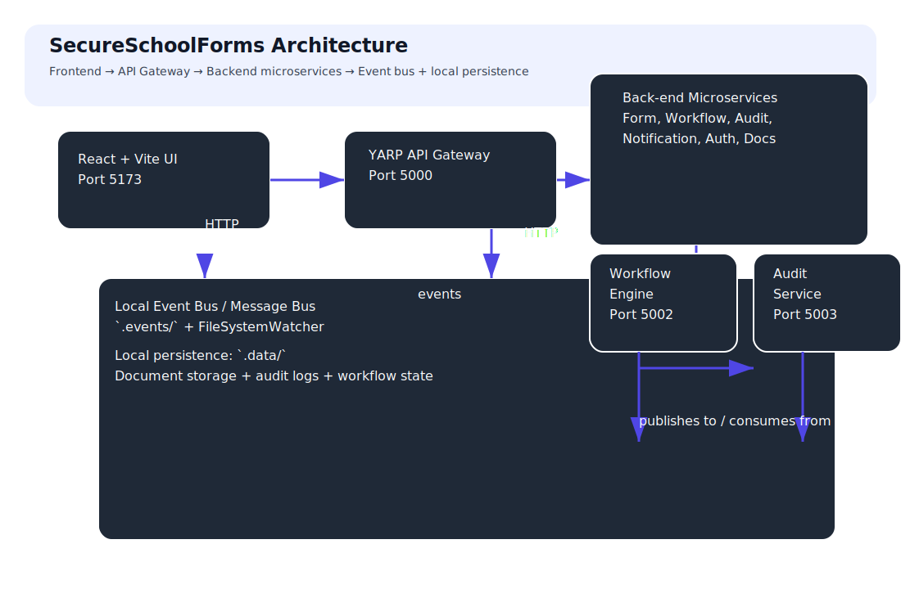
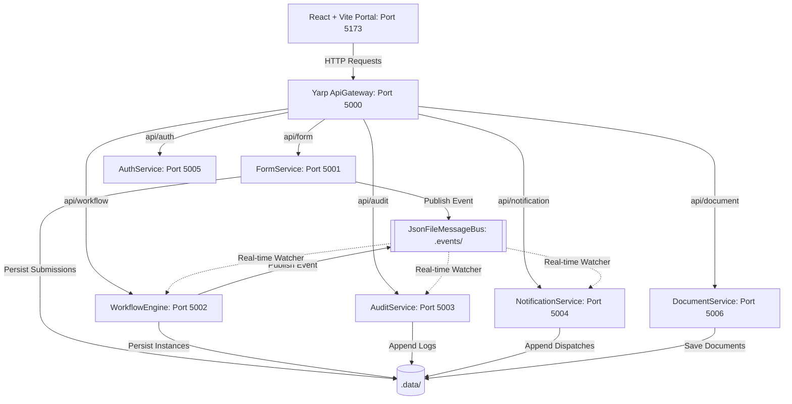

# 🛡️ SecureSchoolForms

SecureSchoolForms is an event-driven administrative portal that helps school districts securely submit, route, approve, and audit student forms. It is built using **modular C# .NET 8 microservices**, a **YARP API Gateway**, and a **React + Vite glassmorphic dashboard**.



## Table of Contents
- [Overview](#overview)
- [Architecture](#architecture)
- [Services & Ports](#services--ports)
- [Quick Start](#quick-start)
- [API Discovery](#api-discovery)
- [Day 6–13 Highlights](#day-6-13-highlights)
- [Project Structure](#project-structure)

---

## Overview

The platform uses a zero-trust, event-driven design with a local-first option for easy development. Backends communicate through a shared message bus and local persistence layer, while the frontend can run independently in simulation mode when the backend is not available.

## Architecture

The core architecture is:
- `frontend` → sends HTTP requests to `SecureSchoolForms.ApiGateway`
- `ApiGateway` → routes traffic to microservices on ports `5001..5006`
- `FormService` → publishes events that drive workflow, audit, and notification services
- `WorkflowEngine` → advances multi-step school office approvals
- `AuditService` → records compliance logs
- `NotificationService` → emits mock SMS/email alerts
- `AuthService` → validates user identities
- `DocumentService` → stores supporting documents and resolves mock Key Vault secrets

### Architecture Diagram




## Services & Ports

| Service | Port | Purpose |
| --- | --- | --- |
| `SecureSchoolForms.ApiGateway` | `5000` | YARP reverse proxy that connects the dashboard to backend services |
| `SecureSchoolForms.FormService` | `5001` | Manages form templates, submissions, and event publishing |
| `SecureSchoolForms.WorkflowEngine` | `5002` | Advances approvals across teacher, admin, and district roles |
| `SecureSchoolForms.AuditService` | `5003` | Persists immutable audit trail events |
| `SecureSchoolForms.NotificationService` | `5004` | Emits mock notifications for workflow changes |
| `SecureSchoolForms.AuthService` | `5005` | Validates user login and roles |
| `SecureSchoolForms.DocumentService` | `5006` | Stores documents and resolves mock Key Vault secrets |
| `frontend` | `5173` | React portal with simulation mode and API integration |

## Quick Start

### Prerequisites
- [.NET 8.0 SDK](https://dotnet.microsoft.com/download/dotnet/8.0)
- [Node.js 18+](https://nodejs.org/)

### Frontend Only (Simulation Mode)

```bash
cd frontend
npm install
npm run dev
```

Then open `http://localhost:5173`.

### Full Backend + Frontend Run

Start each service or use Docker Compose.

#### Run with .NET

```bash
dotnet run --project src/SecureSchoolForms.ApiGateway
dotnet run --project src/SecureSchoolForms.FormService
dotnet run --project src/SecureSchoolForms.WorkflowEngine
dotnet run --project src/SecureSchoolForms.AuditService
dotnet run --project src/SecureSchoolForms.NotificationService
dotnet run --project src/SecureSchoolForms.AuthService
dotnet run --project src/SecureSchoolForms.DocumentService
```

#### Run with Docker Compose

```bash
docker compose build
docker compose up -d
docker compose ps
```

Access:
- Dashboard: `http://localhost:5173`
- API Gateway: `http://localhost:5000`

## API Discovery

Every backend service now exposes Swagger documentation in development mode:
- `http://localhost:5001/swagger`
- `http://localhost:5002/swagger`
- `http://localhost:5003/swagger`
- `http://localhost:5004/swagger`
- `http://localhost:5005/swagger`
- `http://localhost:5006/swagger`

A new gateway-level status aggregator is also available at:
- `http://localhost:5000/status`

## Status Endpoints
Each service also provides:
- `GET /health`
- `GET /status`

Example:

```bash
curl http://localhost:5002/status
```

## Day 6–15 Highlights

### Day 6: Enterprise Messaging
- Added provider-aware message transport with `JsonFile` and `RabbitMQ` modes.
- Built a pluggable `IStorageProvider` abstraction for local or cloud document storage.

### Day 7: Containerization
- Added Dockerfiles for all services and the frontend.
- Created a Docker Compose stack with RabbitMQ and Azurite support.

### Day 8: Observability & Security Polish
- Added `/health` endpoints to every service.
- Improved secure document download metadata.
- Expanded developer onboarding instructions.

### Day 9: API Discovery & Developer Onboarding
- Added Swagger/OpenAPI documentation to all backend services.
- Added `/status` endpoints to surface service identity and health.
- Added an architecture diagram under `docs/architecture.svg`.
- Updated README structure for faster onboarding.

### Day 10: Service Health Dashboard & Gateway Aggregation
- Added API Gateway status aggregation at `http://localhost:5000/status`.
- Added a new frontend **System Status** tab for live microservice health and direct Swagger explorer links.
- Centralized service health visibility to help developers debug startup and routing issues quickly.

### Day 11: Cryptographic Document Vault & Role-Based Secure Downloads
- Integrated `DocumentService` with `AuthService` to verify user identities and roles before releasing file decryption keys.
- Implemented zero-trust RBAC access control policies (blocking `Teacher` role download attempts at both the frontend and backend microservice layer, while granting access to `Admin` and `District` roles).
- Added an interactive **Cryptographic Document Vault Explorer** tab showing uploaded documents, active Key Vault secret references, and digital signature integrity checks.
- Structured automated logging for successful downloads and access violations through the `AuditService` pipeline.

### Day 12: Azure Service Bus Integration
- Configured a cloud-native messaging transport using **Azure Service Bus** alongside `RabbitMQ` and `JsonFile` transports via MassTransit.
- Created flexible, unified consumer and publisher configurations in `SecureSchoolForms.Core` enabling switchable dual-transport bindings.
- Configured default connection string keys in `appsettings.json` configurations and container environment variables.

### Day 13: React Frontend Setup, Routing, and Layout
- Refactored the single 1500+ line `App.tsx` file into a modular, clean component-driven architecture.
- Created standalone page components under `frontend/src/pages/` for `Login`, `SubmitForms`, `TrackWorkflows`, `ApprovalsPortal`, `SystemStatus`, and `RealTimeLogs`.
- Created unified layout wrappers under `frontend/src/components/` for shell rendering (`Layout`) and notifications (`Toast`).
- Configured clean state-based client-side routing to route between pages securely.

### Day 14: Authentication UI & User Registration
- Implemented user registration endpoints in `AuthService` to register new users in connected mode.
- Updated the React login page with a toggle for sign-in and sign-up views.
- Extended the login interface to request Name, Role, and School/District ID for new registrations.
- Implemented state-based local mock user persistence in simulation mode and integration with the AuthService registration API in connected mode.

### Day 15: Forms UI & Template Creation
- Added `CreateFormAsync` persistence handlers to `IFormRepository`, `JsonFileFormRepository`, and `EfFormRepository` in `SecureSchoolForms.Core`.
- Implemented a new `HttpPost` endpoint in the `FormService` `FormController` to support dynamic creation of new form templates.
- Updated the frontend `SubmitForms` view to render a "+ Create Form Template" card for Admin and District roles.
- Implemented an interactive template creation modal form on the dashboard to register new administrative form layouts dynamically.
- Linked form creation actions in `App.tsx` state coordinator to support both local simulation and connected-mode gateway APIs.

## Project Structure

```
├── SecureSchoolForms.sln
├── docs/
│   └── architecture.svg
├── src/
│   ├── SecureSchoolForms.Core/
│   ├── SecureSchoolForms.ApiGateway/
│   ├── SecureSchoolForms.FormService/
│   ├── SecureSchoolForms.WorkflowEngine/
│   ├── SecureSchoolForms.AuditService/
│   ├── SecureSchoolForms.NotificationService/
│   ├── SecureSchoolForms.AuthService/
│   └── SecureSchoolForms.DocumentService/
└── frontend/
    ├── src/
    │   ├── App.tsx
    │   ├── App.css
    │   └── main.tsx
